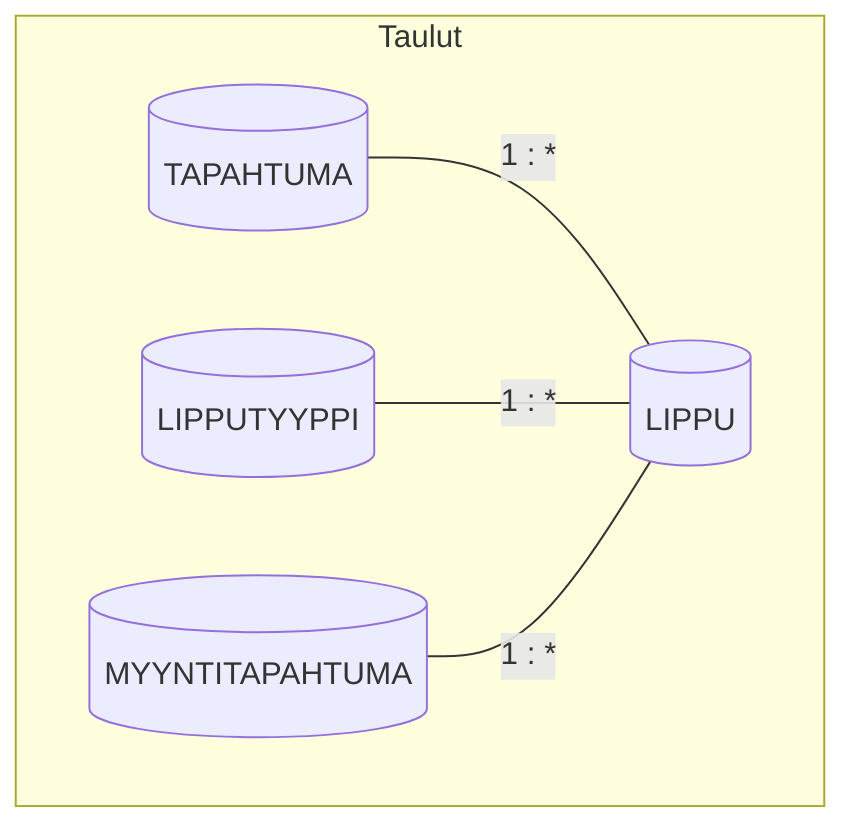
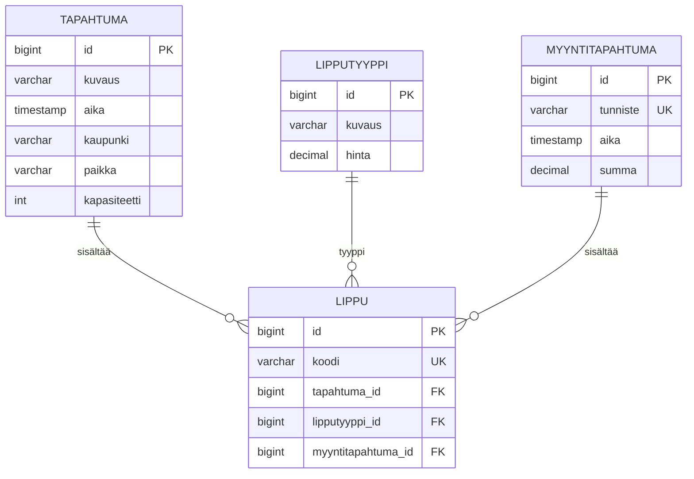

# Tietokanta

## Tietokantakaavio

### 1 ja * -notaatio (cardinaliteetti)

*1 = yksi, * = usea. Esim. TAPAHTUMA 1:* LIPPU = yksi tapahtuma, useita lippuja.*

### ER-kaavio (Crow's Foot -tyyli)

---

## Taulukuvaukset

### TAPAHTUMA (Event)

Tapahtuma, jolle myydään lippuja.

| Sarake | Tyyppi | Kuvaus |
|--------|--------|--------|
| id | BIGINT | Primääriavain, autogeneroitu |
| kuvaus | VARCHAR(255) | Tapahtuman nimi/kuvaus |
| aika | TIMESTAMP | Tapahtuman ajankohta |
| kaupunki | VARCHAR(100) | Kaupunki |
| paikka | VARCHAR(255) | Tapahtumapaikka (esim. Finlandia-talo) |
| kapasiteetti | INT | Maksimimäärä myytäviä lippuja |

---

### LIPPUTYYPPI (TicketType)

Lipputyyppi (aikuinen, lapsi, eläkeläinen jne.) ja sen hinta.

| Sarake | Tyyppi | Kuvaus |
|--------|--------|--------|
| id | BIGINT | Primääriavain |
| kuvaus | VARCHAR(255) | Tyypin kuvaus |
| hinta | DECIMAL(10,2) | Hinta euroina |

---

### MYYNTITAPAHTUMA (SalesTransaction)

Yksi myyntitapahtuma (ostos). Sisältää yhden tai useamman lipun.

| Sarake | Tyyppi | Kuvaus |
|--------|--------|--------|
| id | BIGINT | Primääriavain |
| tunniste | VARCHAR(50) | Uniikki tunniste (esim. 12341234) |
| aika | TIMESTAMP | Maksun ajankohta |
| summa | DECIMAL(10,2) | Kokonaissumma |

**Uniikki rajoite:** tunniste

---

### LIPPU (Ticket)

Yksittäinen myyty lippu.

| Sarake | Tyyppi | Kuvaus |
|--------|--------|--------|
| id | BIGINT | Primääriavain |
| koodi | VARCHAR(50) | Uniikki tunnistekoodi (ovelle) |
| tapahtuma_id | BIGINT | Viite tapahtumaan (FK) |
| lipputyyppi_id | BIGINT | Viite lipputyyppiin (FK) |
| myyntitapahtuma_id | BIGINT | Viite myyntitapahtumaan (FK) |

**Uniikki rajoite:** koodi

---

## Suhteet

| Suunta | Kuvaus |
|--------|--------|
| TAPAHTUMA 1 → * LIPPU | Yksi tapahtuma voi sisältää useita myytyjä lippuja |
| LIPPUTYYPPI 1 → * LIPPU | Yksi lipputyyppi voi esiintyä useassa lipussa |
| MYYNTITAPAHTUMA 1 → * LIPPU | Yksi myyntitapahtuma sisältää yhden tai useamman lipun |

**LIPPU** on keskustaulukko, joka yhdistää tapahtuman, lipputyypin ja myyntitapahtuman.

---

## Indeksit

- `tapahtuma_id` (LIPPU) – haun nopeuttamiseksi tapahtumakohtaisesti
- `myyntitapahtuma_id` (LIPPU) – myyntitapahtuman lippujen haku
- `lipputyyppi_id` (LIPPU) – raportointi lipputyypeittäin

---

## Teknologiat

- **Kehitys:** H2 (in-memory tai tiedosto)
- **ORM:** JPA / Hibernate
- **Migraatiot:** Flyway tai Liquibase (tulevaisuudessa)
